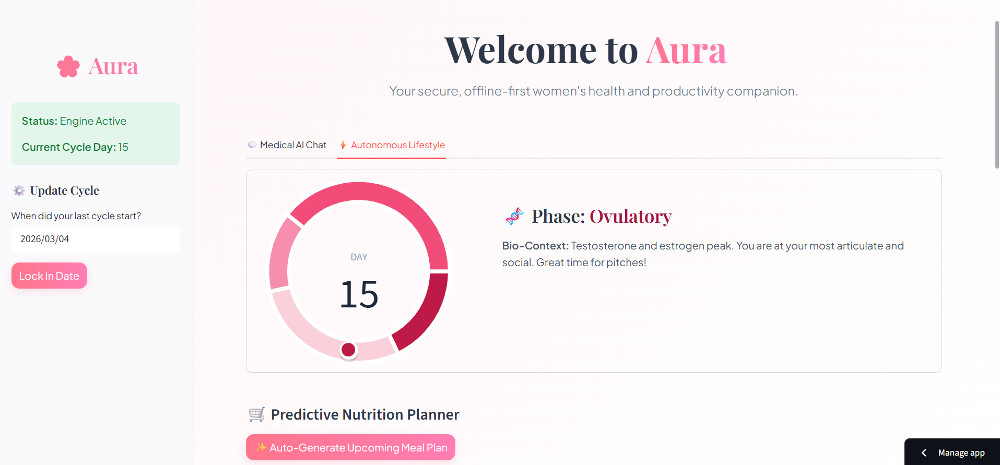

# 🌸 Aura | Women's Health AI Companion

* **Live Link:** (https://auraforyou.streamlit.app/)
 

**Aura** is a clinical AI companion designed to provide deterministic, medically accurate women's health insights without compromising user privacy. Built with a localized Retrieval-Augmented Generation (RAG) pipeline, it ensures zero data leakage of sensitive reproductive queries.

##  Core Architecture & Features

* **Privacy-First RAG Engine:** Utilizes `sentence-transformers` for local document embedding and a localized `Qdrant` vector database, ensuring clinical RAG operations happen without exposing queries to external servers.
* **Clinical Knowledge Base:** Ingests and processes peer-reviewed medical abstracts (via NCBI PubMed API) to ground AI responses in verified endocrinology and preventive care research, strictly preventing LLM hallucination.
* **Deterministic Cycle Scheduling:** A built-in biological tracking algorithm that dynamically aligns daily tasks, physical activity, and nutritional planning with the user's current endocrine phase.
* **Multimodal UI/UX:** Features a premium, glassmorphism-inspired Streamlit frontend with interactive Plotly geometric visualizations, integrated Speech-to-Text for frictionless symptom logging, and FPDF2 for exporting clinical reports.

##  Tech Stack

* **Frontend:** Streamlit, Plotly, custom CSS
* **LLM & Orchestration:** Mistral AI (`mistral-small-latest`), LangChain
* **Vector Database:** Qdrant
* **Embeddings:** HuggingFace (`all-MiniLM-L6-v2`)
* **Data Pipelines:** Biopython (Entrez), JSON, PyPDF2